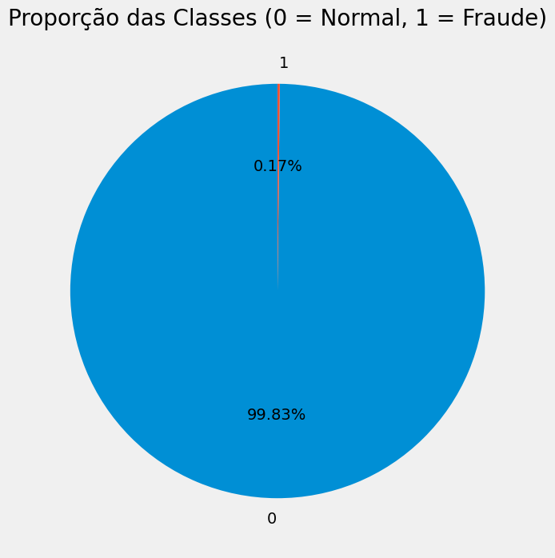
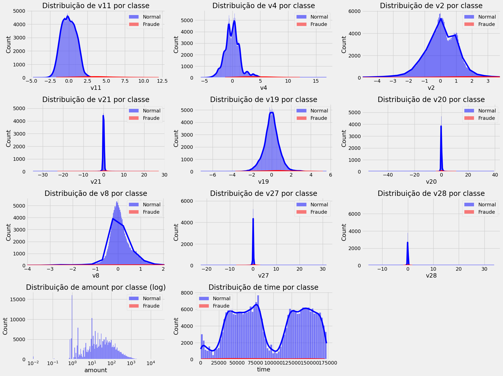
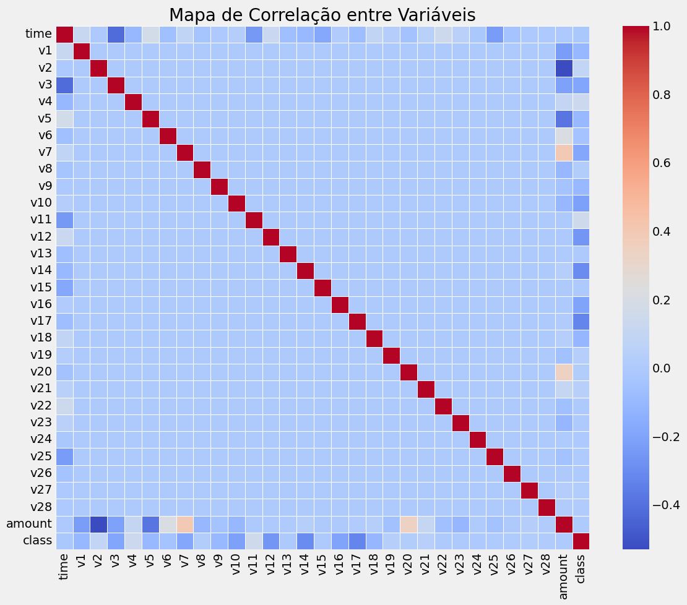
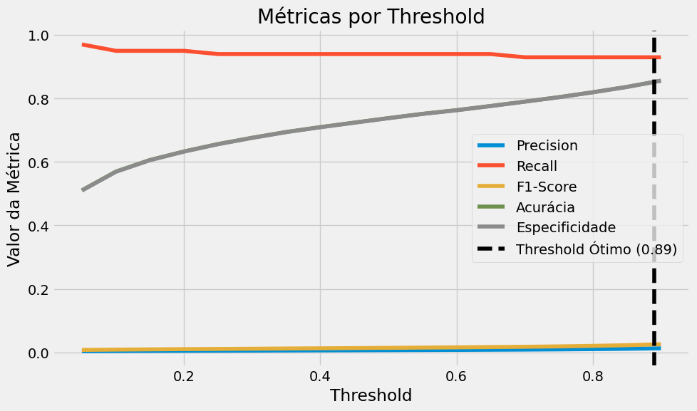
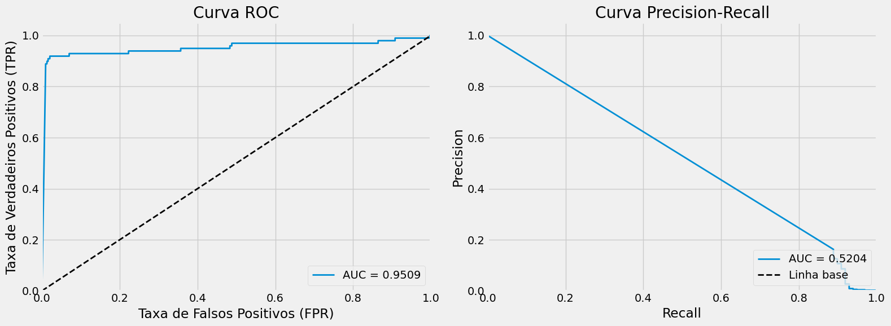

# Modelo de Detecção de Fraude em Cartão de Crédito


Este repositório contém um modelo de machine learning desenvolvido para detectar fraudes em transações de cartão de crédito, implementado usando PyTorch.

## Informações do Projeto

- **Disciplina**: PPGEEC2318 - APRENDIZADO DE MÁQUINA
- **Turma**: T01 (2025.1)
- **Aluno**: Israel da Silva Felix de Lima
- **Matrícula**: 20241028222
- **Orientador**: Prof. Dr. Ivanovitch Medeiros Dantas da Silva ([GitHub](https://github.com/ivanovitchm))
- **Dataset**: [Credit Card Fraud Detection](https://www.kaggle.com/datasets/mlg-ulb/creditcardfraud)
- **Inspirado em**: 
  - [Credit Card Fraud Predictor](https://github.com/karinait/credit_card_fraud_predictor/tree/main)
  - [PPGEEC2318 Week05c](https://github.com/ivanovitchm/PPGEEC2318/blob/main/lessons/week05/week05c.ipynb)

## Model Card

Este model card segue os princípios propostos no artigo [Model Cards for Model Reporting](https://arxiv.org/abs/1810.03993) para documentação responsável de modelos de machine learning.

### Detalhes do Modelo

- **Desenvolvido por**: Israel da Silva Felix de Lima
- **Data de desenvolvimento**: 2025.1
- **Tipo de modelo**: Regressão Logística Binária implementada com PyTorch
- **Versão**: 1.0
- **Framework**: PyTorch
- **Número de features**: 37 (features originais + features derivadas)
- **Dispositivo utilizado**: CPU
- **Hyperparâmetros**:
  - Batch size: 64
  - Learning rate: 0.01
  - Número de épocas: 40

### Uso Pretendido

- **Uso primário**: Detectar transações fraudulentas em operações de cartão de crédito
- **Usuários pretendidos**: Instituições financeiras, sistemas de pagamento, equipes de segurança
- **Casos fora do escopo**: Não deve ser usado como único mecanismo de decisão para bloquear transações sem supervisão humana

### Fatores

- **Fatores relevantes**: Dado o objetivo de detectar fraudes em transações financeiras, os fatores relevantes incluem montante da transação, tempo, localização, características da transação
- **Fatores de avaliação**: O modelo foi avaliado com diferentes thresholds de classificação para balancear entre precisão e recall

### Métricas

As métricas de avaliação foram escolhidas considerando o forte desbalanceamento dos dados:

- **Acurácia**: Proporção de predições corretas (não é a melhor métrica para dados desbalanceados)
- **Precisão**: Proporção de verdadeiros positivos entre os casos classificados como positivos
- **Recall (Sensitividade)**: Proporção de fraudes corretamente identificadas
- **Especificidade**: Proporção de transações legítimas corretamente identificadas
- **F1-Score**: Média harmônica entre precisão e recall
- **AUC-ROC**: Área sob a curva ROC, métrica independente de threshold

### Dados de Avaliação

- **Conjunto de dados**: Conjunto de teste (20% do dataset original após remoção de outliers)
- **Tamanho**: 47.723 instâncias
- **Pré-processamento**: Remoção de outliers usando IQR, normalização com StandardScaler
- **Balanceamento**: Avaliação realizada nos dados originais desbalanceados para representar cenário real

### Dados de Treinamento

- **Conjunto de dados**: Arquivos CSV contendo transações de cartão de crédito
- **Tamanho**: 190.892 instâncias após remoção de outliers
- **Características**: 30 features originais (V1-V28, tempo, montante) e 7 features derivadas
- **Desbalanceamento original**: 484,73:1 (normais:fraudes)
- **Técnica de balanceamento**: Undersampling controlado para proporção de 10:1

### Análises Quantitativas

Resultados com threshold ótimo (0,89):

| Métrica | Valor |
|---------|-------|
| Acurácia | 0,8513 |
| Precisão | 0,0128 |
| Recall (Sensitividade) | 0,9293 |
| Especificidade | 0,8512 |
| F1-Score | 0,0253 |
| AUC-ROC | 0,9509 |

### Considerações Éticas

- O modelo foi treinado com dados anônimos de transações
- Considerações de privacidade foram levadas em conta no desenvolvimento
- O baixo valor de precisão (muitos falsos positivos) sugere que o modelo deve ser parte de um sistema maior de tomada de decisão, não devendo ser usado isoladamente para bloquear transações
- O alto recall é importante para minimizar fraudes não detectadas, mas o custo são mais alertas falsos

### Ressalvas e Recomendações

- O modelo apresenta um trade-off entre precisão e recall, com muitos falsos positivos
- Recomenda-se ajustar o threshold conforme necessidades específicas (maior precisão ou maior recall)
- O modelo deve ser monitorado continuamente e retreinado periodicamente para capturar novas tendências de fraude
- Trabalhos futuros: testar modelos mais complexos (redes neurais multicamadas, modelos de ensemble), explorar técnicas adicionais para lidar com o desbalanceamento

## Visualizações

As seguintes visualizações estão disponíveis no notebook:

1. **Distribuição de classes**  
   

2. **Distribuição de features por classe**  
   

3. **Correlação entre variáveis**  
   

4. **Métricas por threshold**  
   

5. **Curvas ROC e Precision-Recall**  
   

## Tabelas Adicionais

### Características do Dataset

| Aspecto | Informação |
|---------|------------|
| Total de transações | 284.807 |
| Features | 31 (time, v1-v28, amount, class) |
| Valores nulos | Nenhum |
| Classe normal (0) | 284.315 (99,83%) |
| Classe fraude (1) | 492 (0,17%) |
| Valor médio transações | 88,35 |
| Maior transação | 25.691,16 |

### Top 5 Features Correlacionadas com Fraude

| Feature | Correlação |
|---------|------------|
| v11 | 0,155 |
| v4 | 0,133 |
| v2 | 0,091 |
| v21 | 0,040 |
| v19 | 0,035 |

### Principais Observações da Análise Exploratória

- **Desbalanceamento severo**: apenas 0,17% das transações são fraudulentas
- **Dados pré-processados**: features v1-v28 já normalizadas por PCA
- **Correlações baixas**: nenhuma feature isolada é forte preditora de fraude
- **Diferenças visuais**: v11, v4 e v2 mostram distribuições distintas entre classes
- **Valor da transação**: baixa correlação com fraude (0,0056)
- **Necessidades para modelagem**: técnicas para lidar com desbalanceamento e métricas apropriadas (não usar acurácia)

## Como usar o modelo

```python
# Exemplo de código para carregar e usar o modelo treinado
import torch
from torch import nn

# Carregar o modelo
input_dim = 37  # Número de features após engenharia de atributos
model = nn.Sequential(
    nn.Linear(input_dim, 1)
)
model.load_state_dict(torch.load("modelo_regressao_logistica.pth"))
model.eval()

# Função para preprocessar novas entradas
def preprocess(data):
    # Implementar o mesmo preprocessamento usado no treinamento
    # ...
    return preprocessed_data

# Função para detectar fraude
def detectar_fraude(transacao, threshold=0.89):
    preprocessed = preprocess(transacao)
    with torch.no_grad():
        output = model(preprocessed)
        prob = 1 / (1 + torch.exp(-output))
        return prob.item() >= threshold
```

## Referências

1. Mitchell, M., Wu, S., Zaldivar, A., Barnes, P., Vasserman, L., Hutchinson, B., Spitzer, E., Raji, I. D., & Gebru, T. (2019). Model Cards for Model Reporting. In Proceedings of the Conference on Fairness, Accountability, and Transparency (pp. 220-229).

2. ULB Machine Learning Group. (2018). Credit Card Fraud Detection Dataset. Kaggle. https://www.kaggle.com/datasets/mlg-ulb/creditcardfraud

3. Karina, I. T. (2023). Credit Card Fraud Predictor. GitHub. https://github.com/karinait/credit_card_fraud_predictor/tree/main

4. Dantas da Silva, I. M. (2023). PPGEEC2318 - Week05c: Architecture class for PyTorch. GitHub. https://github.com/ivanovitchm/PPGEEC2318/blob/main/lessons/week05/week05c.ipynb
